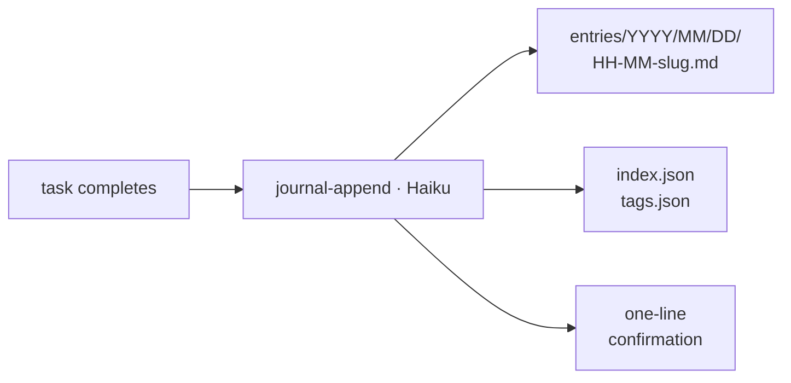

# journal

An auto-journaling plugin for Claude Code. After significant tasks — decisions, non-obvious solutions, architectural choices, learnings — Claude spawns a Haiku sub-agent to write a structured markdown entry for you. Entries accumulate as a tagged history you can read directly or hand to a future session to draft a blog post from.

Run `/journal setup` once. Everything else is automatic; manual commands exist only as escape hatches.

## Install

```bash
claude plugin marketplace add vivecuervo7/claude-plugins
claude plugin install journal@vive-claude
```

## Setup

Run `/journal setup` once. Setup asks where to store entries (default: `~/.claude-journal`) and installs auto-journal instructions into your CLAUDE.md. You can decline the install for manual-only behaviour, but hands-off is the point.

By default, auto-journaling runs in the foreground — the parent session pauses for a few seconds while Haiku writes the entry. To run it non-blocking, edit `~/.claude/.vive-claude/journal/CLAUDE.md` and add `run_in_background=true` to the `Agent(...)` call. Caveat: background agents can't prompt for tool permissions, so the underlying Bash scripts (`journal-context.sh`, `journal-index.js`, etc.) must be pre-approved in your `settings.json` first.

## How it works



What you see in the parent session:

```
Journaled: Added rate limiting to API endpoints → entries/2026/03/05/14-32-my-api.md
  📷 Capture while fresh: rate limiter dashboard showing request throttling
```

| Surface | Role |
|---------|------|
| `journal-append` agent | Writes entries. Spawned automatically after task completion, or manually via `/journal`. |
| `journal-attach` agent | Attaches a media file to today's entry, via `/journal attach <file>`. |
| `/journal` command | Single user-facing dispatcher — falls through to `attach`, `setup`, or `append`. |

One entry per project per day — updates refine the existing entry rather than creating duplicates. The append agent prefers existing tags from the registry when semantically similar, keeping the namespace from drifting.

## Commands

| Command | Description |
|---------|-------------|
| `/journal [focus]` | Manually journal recent work, optionally with text as the focus/annotation |
| `/journal attach <file> [project]` | Attach media to today's entry |
| `/journal setup` | Configure storage location and enable auto-journaling (one-time) |
| `/journal doctor` | Diagnostic checklist — confirms pointer file, auto-journal install, and other expected state |

## Storage

Entries live at `~/.claude-journal/` by default. Override during setup or with `CLAUDE_JOURNAL_ROOT`.

```
~/.claude-journal/
├── tags.json
└── entries/
    └── 2026/
        └── 03/
            ├── index.json
            └── 05/
                ├── 14-32-my-api.md
                └── media/
                    └── 14-32-my-api-01.png
```

Each entry is a standalone markdown file with YAML frontmatter — portable and suitable for blog post generation. `entries/YYYY/MM/index.json` holds a per-entry summary (date, project, tags, summary, file path, media count) for every entry in that month. `tags.json` is a frequency map of every tag in use. Both are maintained on every append so external consumers (a future Claude session drafting a blog post, say) can scan one JSON file instead of opening every entry.

## Tags

Each entry's tags should cover three angles when relevant:

- **Topic / domain** — what the work is about (e.g., `auth`, `rate-limiting`, `journal-plugin`)
- **Tech** — language, framework, or tool involved (e.g., `typescript`, `react`, `playwright`)
- **Kind / signal** — nature or blog/demo potential (e.g., `bugfix`, `refactor`, `architecture`, `exploration`, `blog-worthy`, `demo-worthy`)

## License

MIT
