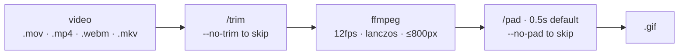

# media

Media utilities for Claude Code. Each command bundles a recurring screen-recording or video chore into a single slash command with sensible defaults — natural-language file hints, preflight checks, helpful failure modes — so these tasks stop being a trip to the man page.

Three commands today: `/gif` (encode), `/trim` (cut dead air), `/pad` (hold the last frame). `/gif` composes the other two, but each is useful on its own.

## Install

```bash
claude plugin marketplace add vivecuervo7/claude-plugins
claude plugin install media@vive-claude
```

## Requirements

macOS-only — commands rely on Screen Recording filename conventions, Desktop/Downloads/Movies search paths, and Homebrew for dependencies.

```bash
brew install ffmpeg uv
```

- `ffmpeg` — encode/decode for `/gif` and `/trim`.
- `uv` — provides `uvx`, which runs [auto-editor](https://github.com/WyattBlue/auto-editor) in an isolated environment. No system Python required.

Each command checks its own dependencies before doing any work.

## Commands

| Command | Description |
|---------|-------------|
| `/gif [file or hint] [--no-trim] [--no-pad] [--threshold N%] [--hold N]` | Convert a video to a PR-suitable GIF. Composes `/trim` → encode → `/pad`. |
| `/trim [file or hint] [--threshold N%]` | Cut idle / loading-spinner segments out of a video or gif using motion detection. |
| `/pad [file or hint] [--hold N]` | Hold the last frame of a video or gif for N seconds (default 1.5). |

All three accept a path, a natural-language hint (`last screen recording`, `latest recording on desktop`), or no argument at all — in which case they pick the newest video across `~/Desktop/`, `~/Downloads/`, and `~/Movies/`.

### `/gif`



Tuned for embedding in GitHub pull requests — small enough to upload, sharp enough to read.

```
/gif                              # newest video across Desktop / Downloads / Movies
/gif ~/Desktop/demo.mov
/gif last screen recording
/gif --no-trim                    # skip the auto-editor step
/gif --no-pad                     # no last-frame hold
/gif --threshold 4%               # cut more aggressively
/gif --hold 1                     # bump the built-in pad to 1s
```

Output lands beside the source with a context-derived name (e.g. `geo-chat-flow.gif`). Files over 10MB get a warning — GitHub's upload limit will reject them.

The default pad is intentionally tiny. When the recording ends on a proof-of-fix frame and you want it to linger, run `/pad` on the output afterwards rather than re-encoding with a larger `--hold` — `/pad` works directly on the gif, no source video needed.

### `/trim`

Strips static segments out of a recording using motion analysis. Auto-editor scores each frame against the previous one and drops anything below the threshold — loading spinners, network waits, and idle screens get cut; cursor movement, typing, and animation are preserved.

Works on video (`.mov`/`.mp4`/`.webm`/`.mkv`) and existing `.gif` files. Output keeps the input's extension with `-trimmed` inserted before the suffix (`demo.mov` → `demo-trimmed.mov`).

```
/trim                             # newest video, default 2% threshold
/trim ~/Desktop/long-repro.mov
/trim --threshold 4%              # more aggressive — cuts mouse-only motion too
/trim demo.gif                    # round-trips through mp4, re-encodes to gif
```

The default `2%` threshold is tight enough to cut waits and loose enough to keep meaningful UI feedback. Tune up for tighter cuts, down if you find something useful is missing.

### `/pad`

Useful when the recording ends on a proof-of-fix frame (a green checkmark, a final form state, the bug not happening) and you want the reader to register it before the loop restarts.

Works on gif and video input. Output keeps the input's extension with `-padded` inserted before the suffix. Cloned frames compress to almost nothing in gif, so the size delta is negligible.

```
/pad                              # newest file, default 1.5s hold
/pad ~/Desktop/AE-1759-after.gif
/pad --hold 2                     # longer pause
/pad demo.mov --hold 0.75         # fractional values OK
```

## License

MIT
